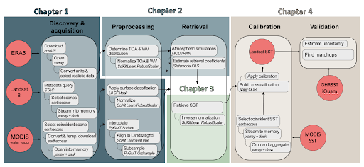

# From Raw Pixels to Products: Building a Landsat Sea Surface Temperature Product Cookbook



[](https://github.com/ProjectPythia/cookbook-template/actions/workflows/nightly-build.yaml)
[](https://binder.projectpythia.org/v2/gh/ProjectPythia/cookbook-template/main?labpath=notebooks)
[](https://zenodo.org/badge/latestdoi/475509405)

Where do you start if the data product you need doesn’t exist yet? Designing a scientific algorithm is already a challenge — making it automated, open, reusable, and cloud-ready is even harder. This project creates a cookbook that guides users through building a data product algorithm using best-in-class open methods, with Landsat sea surface temperature (SST) as the case study. It demystifies complex steps like thermal infrared atmospheric correction and avoids dependence on proprietary radiative transfer models. 

This Project Pythia Cookbook covers how to create a data product from a raw image. 

## Motivation

- Streamlines some of the biggest time sinks in science: data access and generation
- Makes complex thermal correction and retrieval methods more accessible
- Provides a full, reproducible workflow — from data download to robust error quantification — for training new users and accelerating applied research

## Authors

[Tasha Snow](https://github.com/tsnow03), [Genevieve Clow](https://github.com/genna-clow), [Kathryn Moore](https://github.com/kamoore14), [Arman Oliazadeh](https://github.com/Arri2424), [Jianwen Du](https://github.com/Janewendo). 

### Contributors

<a href="https://github.com/ProjectPythia/cookbook-template/graphs/contributors">
  
</a>

## Structure

This cookbook is broken into seven chapters: data access, data prepreprocessing, building a brightness temperature correction, retrieving a corrected value, calibrating, validating with in situ data, and producing the data file.

### Section 1 Data Access

Teaches how to most effectively find and access your datasets from a local laptop or the cloud.

### Section 2 Data Preprocessing

Learn about the different steps involved in data preprocessing as the data is prepared to be used in conjunction with other datasets and eventually corrected and applied within a retrieval.

### Section 3 Raw Image Correction

We need to determine what corrections to the satellite measurements are required. The corrections can stem from physical processes 
that would impact amplitude, timing, or wavelength of observations, or instrument-related corrections.

### Section 4 Retrieval

Now that our data is ready for processing together and we know the corrections needed for our data, we need to apply them through a retrieval algorithm.

### Section 5 Calibration

Learn why we would want to calibrate our new dataset and how to do so.

### Section 6 Validation

Learn about what data to use for validation, why we want to validate, and potential models we can use for validation.

## Running the Notebooks

You can either run the notebook using [Binder](https://binder.projectpythia.org/) or on your local machine.

### Running on Binder

The simplest way to interact with a Jupyter Notebook is through
[Binder](https://binder.projectpythia.org/), which enables the execution of a
[Jupyter Book](https://jupyterbook.org) in the cloud. The details of how this works are not
important for now. All you need to know is how to launch a Pythia
Cookbooks chapter via Binder. Simply navigate your mouse to
the top right corner of the book chapter you are viewing and click
on the rocket ship icon, (see figure below), and be sure to select
“launch Binder”. After a moment you should be presented with a
notebook that you can interact with. I.e. you’ll be able to execute
and even change the example programs. You’ll see that the code cells
have no output at first, until you execute them by pressing
{kbd}`Shift`\+{kbd}`Enter`. Complete details on how to interact with
a live Jupyter notebook are described in [Getting Started with
Jupyter](https://foundations.projectpythia.org/foundations/getting-started-jupyter).

Note, not all Cookbook chapters are executable. If you do not see
the rocket ship icon, such as on this page, you are not viewing an
executable book chapter.


### Running on Your Own Machine

If you are interested in running this material locally on your computer, you will need to follow this workflow:

1. Clone the `https://github.com/ProjectPythia/landsatproduct-cookbook` repository:

   ```bash
    git clone https://github.com/ProjectPythia/landsatproduct-cookbook.git
   ```

2. Move into the `landsatproduct-cookbook` directory
   ```bash
   cd landsatproduct-cookbook
   ```
3. Create and activate your conda environment from the `environment.yml` file
   ```bash
   conda env create -f environment.yml
   conda activate landsat-product-cookbook-dev
   ```
4. Move into the `notebooks` directory and start up Jupyterlab
   ```bash
   cd notebooks/
   jupyter lab
   ```
